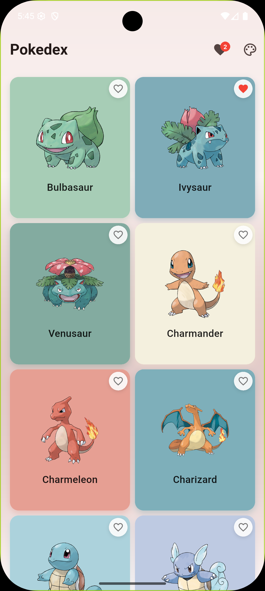
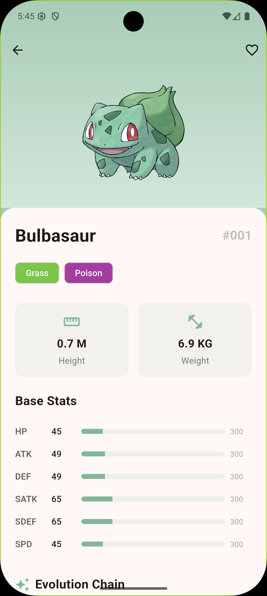
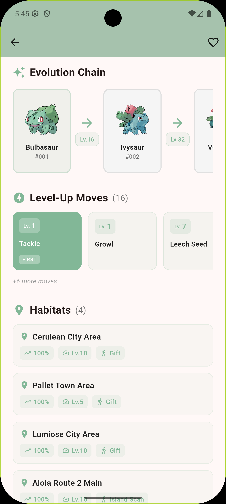

# Flutter Pokedex

一个使用 Flutter 构建的宝可梦图鉴应用，数据来源于 [PokeAPI](https://pokeapi.co/)。

## 功能特性

### 列表页
- 宝可梦列表展示（2列网格布局）
- 无限滚动分页加载
- 下拉刷新
- 从宝可梦图片提取主色调作为卡片背景
- 收藏功能（红心标记）
- Hero 共享元素转场动画

### 详情页
- 基础信息（名称、ID、类型、身高、体重）
- 能力值展示（HP、攻击、防御等）带进度条动画
- **进化链条可视化**：横向滚动展示完整进化路径，包含进化条件（等级、道具等）
- **技能列表**：水平滚动卡片展示，按等级排序，突出显示首个技能
- **栖息地/出现地点**：展示遭遇地点、概率、等级范围和遭遇方式
- 收藏/取消收藏

### 数据与性能
- 本地 SQLite 缓存，支持离线查看
- 缓存优先策略，减少网络请求
- 图片缓存优化

## 技术栈

- **状态管理**: Riverpod
- **网络请求**: Dio
- **本地存储**: SQLite (sqflite)
- **图片缓存**: cached_network_image
- **颜色提取**: palette_generator

## 项目结构

```
lib/
├── main.dart                 # 应用入口
├── data/
│   ├── api/                  # 网络请求层
│   ├── database/             # 本地数据库
│   ├── models/               # 数据模型
│   └── repository/           # 数据仓库
├── providers/                # Riverpod 状态管理
└── ui/
    ├── pages/                # 页面
    └── widgets/              # 可复用组件
```

## 应用截图

<div align="center">
  
  
  
</div>

<div align="center">
  <p><em>左：宝可梦列表页 | 中：详情页（基础信息、能力值）| 右：详情页（进化链、技能、栖息地）</em></p>
</div>

## 开始使用

### 环境要求

- Flutter SDK >= 3.9.2
- Dart SDK >= 3.9.2

### 安装运行

```bash
# 克隆项目
git clone https://github.com/your-username/ff_pockedex.git
cd ff_pockedex

# 安装依赖
flutter pub get

# 运行应用
flutter run
```

### 构建发布

```bash
# Android
flutter build apk

# iOS
flutter build ios
```

## API

本应用使用 [PokeAPI](https://pokeapi.co/) 作为数据源，这是一个免费开放的宝可梦 RESTful API。

## License

MIT License